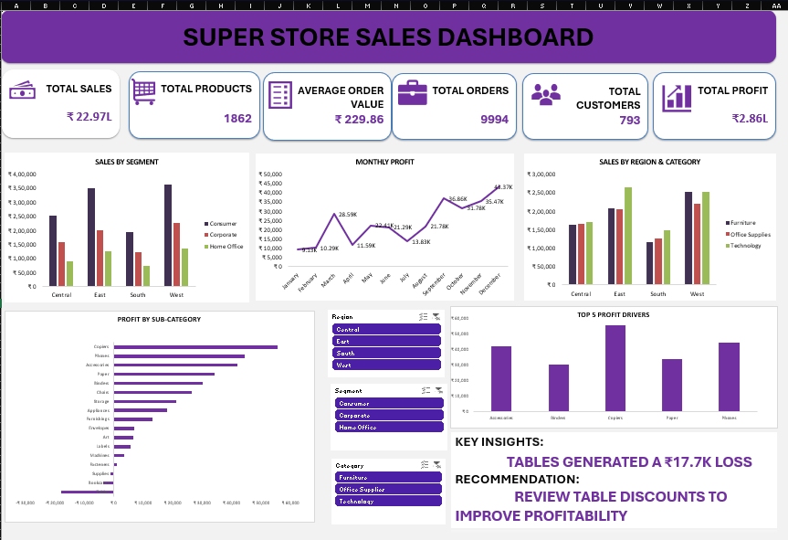

# 📊 Superstore Sales Dashboard

An interactive Excel dashboard built on the classic **Sample Superstore** dataset, analyzing sales, profit, and order performance across regions, segments, and product categories.

Analyzed **9,994 orders** across **1,862 products** and **793 customers**, generating **₹22.97L in total sales** and **₹2.86L in profit**.

## 🔑 Key Metrics (KPIs)

| Metric | Value |
|---|---|
| Total Sales | ₹22.97L |
| Total Products | 1,862 |
| Average Order Value | ₹229.86 |
| Total Orders | 9,994 |
| Total Customers | 793 |
| Total Profit | ₹2.86L |

## 📈 Dashboard Features

- **Sales by Segment** — Consumer, Corporate, and Home Office sales broken down by region (Central, East, South, West)
- **Monthly Profit Trend** — Line chart tracking profit month-over-month across the year
- **Sales by Region & Category** — Furniture, Office Supplies, and Technology performance across all four regions
- **Profit by Sub-Category** — Horizontal bar chart ranking all product sub-categories by profitability (Copiers highest, Tables lowest)
- **Top 5 Profit Drivers** — Best-performing sub-categories by total profit
- **Interactive Slicers** — Filter the entire dashboard by Region, Segment, and Category
- **Key Insights & Recommendations** — e.g., *Tables generated a ₹17.7K loss; review table discounts to improve profitability*

## 🗂️ Data Source

Built on the **Sample Superstore** dataset (a widely used retail sales dataset for BI/analytics practice), containing order-level records with:

- Order & ship dates, ship mode
- Customer details and segment
- Geography (country, state, city, region)
- Product category, sub-category, and product name
- Sales, quantity, discount, and profit figures

## 🛠️ Tools Used

- **Microsoft Excel** — PivotTables, PivotCharts, slicers, and formulas for KPI calculations
- Data cleaning and transformation on raw order-level transaction data

## 📁 Repository Contents

| File | Description |
|---|---|
| `Sample_Superstore_Dashboard.xlsx` | Full Excel workbook with raw data, pivot analysis, and dashboard |
| `dashboard_screenshot.png` | Preview image of the dashboard |
| `README.md` | Project documentation (this file) |

## 🚀 How to Use

1. Download `Sample_Superstore_Dashboard.xlsx`
2. Open in Microsoft Excel (Excel 2016+ recommended for full slicer/PivotChart support)
3. Use the **Region**, **Segment**, and **Category** slicers on the dashboard tab to filter the view interactively

## 💡 Key Insight

Tables are the biggest drag on profitability, generating a **₹17.7K loss** overall — largely driven by high discounting. Reviewing and tightening discount policy on Tables is the top recommendation for improving overall profit margins.

---

*Dataset: Sample Superstore (commonly used for BI/dashboarding practice with Tableau, Power BI, and Excel).*

## 👩‍💻 Author

**Varsani A**
B.Tech Information Technology
